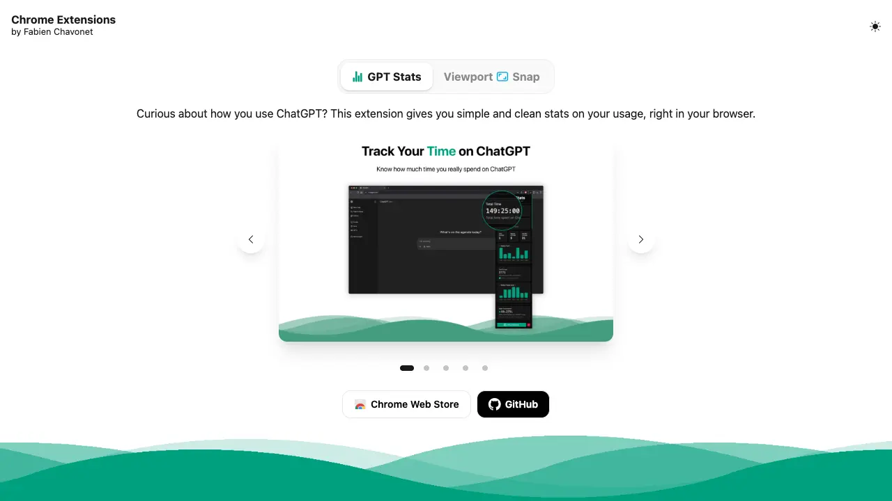
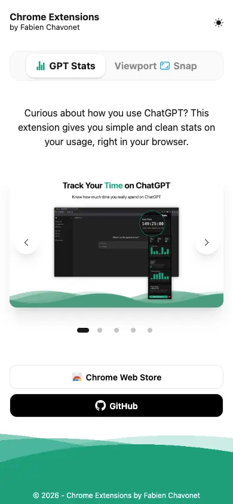

# Landing Page: Chrome Extensions

## Description

This project is a simple and responsive landing page designed to showcase the Chrome extensions I create and publish.

Instead of maintaining a separate presentation page for each extension, the website provides a single place where users can discover my projects, browse their promotional screenshots, read a short description, and access their GitHub repository or Chrome Web Store page.

The extensions and their associated information are stored in a JSON file, making the landing page easy to update as new projects are released.

## Objectives

- Create a single landing page to showcase my Chrome extensions.
- Provide a simple way to switch between the available extensions.
- Display a short description and promotional screenshots for each project.
- Provide direct links to the Chrome Web Store and GitHub repositories.
- Keep extension information separated from the interface using JSON data.
- Provide a responsive interface for desktop and mobile devices.
- Support light and dark themes.
- Make it easy to add new extensions in the future.

## Tech Stack


## File Description

| **FILE**            | **DESCRIPTION**                                                         |
| :---------------: | ------------------------------------------------------------------------- |
| `assets`          | Contains the resources required for the repository.                       |
| `index.html`      | Main structure of the landing page.                                       |
| `style.css`       | Contains the custom styles and animated wave effect.                      |
| `script.js`       | Handles extension loading, tabs, carousel navigation and dynamic content. |
| `extensions.json` | Contains the information displayed for each Chrome extension.             |
| `README.md`       | The README file you are currently reading 😉.                             |

## Installation & Usage

### Installation

1. Clone this repository:
    - Open your preferred Terminal.
    - Navigate to the directory where you want to clone the repository.
    - Run the following command:

```
git clone https://github.com/fchavonet/full_stack-landing_page-chrome_extensions.git
```

2. Open the cloned repository.

### Usage

1. Open the `index.html` file in your web browser.

You can also test the project online by clicking [here](https://fchavonet.github.io/full_stack-landing_page-chrome_extensions/).

<table align="center">
    <tr>
        <th align="center" style="text-align: center;">Desktop view</th>
        <th align="center" style="text-align: center;">Mobile view</th>
    </tr>
    <tr valign="top">
        <td align="center">
            <picture>
                <source media="(prefers-color-scheme: light)" srcset="./assets/images/screenshots/desktop_page-light.webp">
                <source media="(prefers-color-scheme: dark)" srcset="./assets/images/screenshots/desktop_page-dark.webp">
                
            </picture>
        </td>
        <td align="center">
            <picture>
                <source media="(prefers-color-scheme: light)" srcset="./assets/images/screenshots/mobile_page-light.webp">
                <source media="(prefers-color-scheme: dark)" srcset="./assets/images/screenshots/mobile_page-dark.webp">
                
            </picture>
        </td>
    </tr>
</table>

## What's Next?

- Add new Chrome extensions as they are developed and published.
- Keep promotional screenshots and extension information up to date.
- Continue improving the responsive layout and user experience.

## Thanks

- A big thank you to my friends Pierre and Yoann, always available to test and provide feedback on my projects.

## Author(s)

**Fabien CHAVONET**
- GitHub: [@fchavonet](https://github.com/fchavonet)
